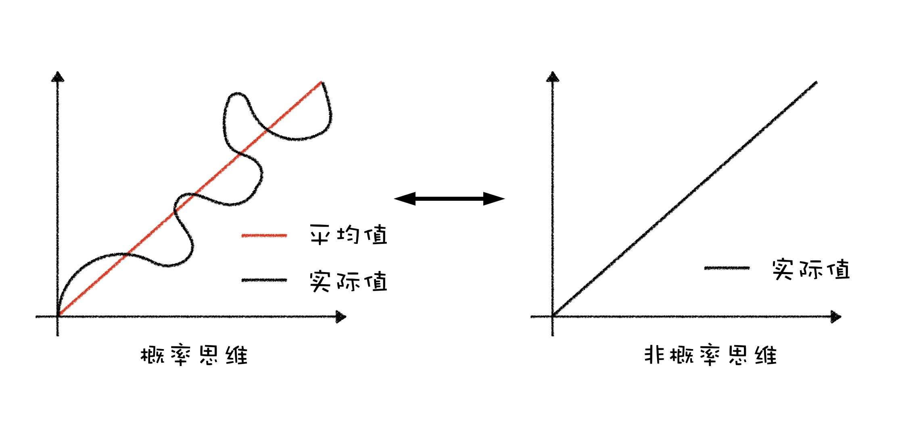

# 财富观

合适的财富观是坚持理财、做好理财的基础，虽然观念这东西说起来有点虚的，但是却很重要，这涉及到我们的价值观。如果一个人常常把「享乐人生、月光消费」挂在嘴边，是很难积累下财富的。合适的财富观是我们的基本动力，财富观正，钱总会有的。

## 财富观纠偏

### 没钱是开始理财的最佳时机，不要「等我有钱以后」

> 写给那些即将参加工作或者参加工作不久的朋友。

有人说，毕业后的头五年基本决定了大家拉开的差距。我认为这个观点也同样适用于财务状况。毕业头五年对于理财的意识（是意识，**不是**能力），基本决定了后期的财务状况。

#### 从没钱到“有钱”

工资收入的阶段性跨越，是财务积累的主要拐点。而且每个人都有**至少**两次机会，第一次是毕业参加工作，第二次则是工作早期的工资快速上涨。这两个拐点基本都发生在工作的头几年，把握好这两个机会的前提正是理财意识。

在《投资第一课》中读到过一个关于储蓄率的讨论：

> A 原收入 5000 元，每个月储蓄 500 元，那么储蓄率为 10%。
> 
> 如果 A 涨工资 5000 元，其中一半用来增加储蓄，则每月储蓄 3000 元，储蓄率就变成了 30%，实现了 **200%** 的增长，储蓄金额增加了 **6** 倍。
> 
> 如果 A 涨工资以后，依然保持储蓄 500 元，那么储蓄率就变成了 5%，下降了 50%。

前后两种不同的决定会导致未来全然不同的结果。储蓄相差 6 倍，如果再考虑未来的投资收入，后期的差距甚至可以达到数十倍。工作头几年拉开的差距，从财务的视角来看，就是**储蓄率**的差距。

很多投资界大V们常说，早期的财富积累主要是靠自身的收入增长，而不是投资收入（因为本金少）。其实这句话只说了一半，财富积累靠的是储蓄增长，是收入增长与开支控制的共同结果。如果收入和开支同步增长，那么早期的财富积累也就无从谈起了。

#### 没钱才更有机会

没钱往往意味着低消费，而这正是储蓄的基础。这个时候正是形成理财意识的最佳时机，能力可以不足，但是意识应该跟上。

参考前面关于「储蓄率」的讨论，这个时期是实现储蓄率飞速增长的最有效时期。由于前期的基数低，这个时期工资收入翻倍并不是难事。但是，重要的前提是能够维持消费不要快速升级。如果工资翻倍，而消费只是微增，储蓄率就很容易实现成倍的增长。

相比之下，如果已经习惯高收入、高消费，想要消费降级回到以前的消费水平却是难上加难，上去了以后想要再下来就要困难得多。

而一人吃饱全家不饿的没钱时期，维持消费水平，或者只是少增加一点消费改善生活，并不困难。如果这个时期没能好好利用，等到人到中年，收入虽然很高，但是上有老下有小，再背个房贷、车贷，消费就很难再降下来了。

之前读到过 @银行螺丝钉 的一篇读书笔记，书名《不上班也有錢》。因为是台湾出版，我没能找到购买途径，就把读书笔记翻来覆去的读了很多遍。作者利用工作头十年实现了财务自由，然后开始环游世界，靠的就是早期对于消费的克制。这个时期的克制换来的是未来几十年的自由，不自律无自由。

更加励志的是作者基本没有什么高大上的投资技巧，就是老老实实的买指数基金，中间还经历了 08 年的金融危机，最终依然实现了目标。这进一步印证了「理财意识远比能力更重要」。

#### 储蓄，最有效的原始积累

储蓄算得上普通人积累财富最有效的方式。不可能每个人都去创业增收，也不可能每个人都被老板重用提把，但是储蓄却是人人都能做到的。

几乎每一个在财务上取得成功的前辈都不遗余力的强调储蓄的重要性，比较经典的建议便是「花一半，存一半」。

之前读过一本书《邻家的百万富翁》，作者为银行和资管机构调查了很多高净值人群，最终发现他们无一不是拥有很高的储蓄率，对消费非常克制（相对于他们的收入情况），而且大部分家庭都有非常明确的年度预算计划。

这本书对我的财富观影响很大，也推荐给大家（不过好像很难买到了，当初也是迫不得已去找了盗版）。我也是从读这本书以后开始基于记账认真制定年度预算并执行，真正的把记账的功能发挥出来。

##### 花一半，存一半

克制消费、增加储蓄并不总是等同于降低生活质量。《小狗钱钱》中给出过一条很好的建议：

> 每当面对收入增长时，总是用一半来消费改善生活，另一半则用来增加储蓄。

因为是新增加的收入，少花一些并不会影响生活品质，花一半、存一半则实现了改善生活和增加储蓄的平衡。

另外，开始控制消费以后，我个人的生活水平其实反而有所上升。因为预算有限，更加注意「好钢用在刀刃上」，买东西总要反复权衡，少买了很多没用的东西，真正改善生活的物品反倒是一样都没落下。而以前想起来什么东西就直接买，等到真的需要的东西反而就没钱了。

#### 没钱 = 风险承受能力

更高的风险承受能力是可以换钱的。在本金少的时候开始接触理财有两个优势：

* 本金少，亏算少，“学费”更便宜。
* 可以尝试波动性更大的投资途径。

这两个优势都是可以直接带来真金白银的。年轻人的风险承受能力普遍比较高，来自家庭的压力也更小。这个时候可以选择更大比例的高波动、高收益投资，比如指数基金。

而人到中年以后，由于各方面的原因，风险承受能力大幅下降，需要配置更高比例的保守投资，直接拉低最终收益水平。

在早期从学生身份向工作身份过渡的阶段，理财意识的建立与否可以很大程度的影响以后的财务状况。

> 如果我晚十年开始，一定不是现在这个结果。
> 
> ——巴菲特

---- 

### 当我说没钱可理、没有时间时，我究竟想说什么？

> 不要把自己的主观问题变成客观条件的限制，妄图降低自己内心的焦虑。

「我没有钱」、「我没时间」，这哥俩算得上理财的两个老大难了，也是我们最常听到的两个拒绝理财的理由。

其实，如果单从字面理解，这两个问题倒没有多难。没钱，要么多赚、要么多省；没时间，挤挤就好了，不管再忙，每个月几十分钟的时间还是拿得出来。

既然解决方法并不难，为什么这两个原因还是当仁不让的成为不能理财的两个首要难题？这两句话完全不是字面上这么简单……

##### 「我没有钱」

单从字面理解这个问题，对应没有本金的方案有很多：

* 每个月工资到手，先投资，剩下来的用来消费；
* 涨工资后，只把涨幅的一半用来改善生活，另一半当做不存在，用于投资；
* 制定每月预算，减少购买那些用不上的东西；
* …………

最初听到类似的抱怨时，我都是这么回答的，热心提供各种积累第一桶金的建议。可是，再过一年半载，再次聊起理财，得到的答案依然是「等我有钱了的」。

开始我还表示理解，可能是真的省不下钱。可是当这样的事情越来越多的时候，我才搞明白，其实问题并不在钱。如果把没钱可理挂在嘴边，即使真的有了钱，基本也不会想着理财，而是早就盘算好要买什么东西、去哪里玩了。

「没有钱理财」，其实本意是**「不愿意把钱留给理财」**，相比于“难受”的理财，还是消费更痛快。如果把动词从「理财」换成「买手机」或者「买包」，答案立刻就变了「没事，我省省，再攒一点就够了」或者「没钱也可以先研究研究，看看」………

##### 「我没有时间」

如果确实很忙，平时闲暇时间很少，对应的方案也很多。基金定投或者大类资产配置再平衡，都花不了什么时间，每个月几十分钟、甚至每年几十分钟就已经足够。获得市场的平均回报，买入并持有被动投资，对于时间没什么要求。

但是真的没有时间吗？其实不是，而是因为对理财提不起兴趣，或者觉得相比于理财，把花时间窝在沙发里看剧更舒服。

##### 找客观原因总是更容易

为什么相比于不感兴趣、懒惰、想要消费，我们更愿意脱口而出「我没钱（时间）」？

自己主观不愿意理财，说出来并不容易接受，好像在贬低自己。而变成没有钱、没有时间，说出来就容易很多，「你看，不是我不想，是客观条件真的不允许啊」。* 
但是，虽然我们的内心得到安慰，实际行动却被阻碍了。（而且，既然大家关注了也谈钱，至少说明大家还是想要理财的、想要改变的）只有当我们开始承认问题在自己，改变才成为可能。找到自己内心的想法，把责任从他人划归回自己的身上，才是改变的开始。如果确实想要理财，就不应该在客观条件上找原因安慰自己，承认现实才是改变现实的起点。

##### 找到属于自己的动机

理财是场持久战，单单一份承认可能还不够，还需要足够驱动自己的动机。对我而言，我自己愿意研究理财、愿意花时间，很大程度是基于，我相信理财可以实现财务自由，进而可以解决很多让我深恶痛觉的大难题：

* 工资的天花板
* 没有自己的灵活的时间
* 限于工作，却忘了自己真正想要的东西，或者不断的妥协
* 中年危机和中产阶级陷阱

也正是对于解决问题的渴望，拉动着我不断学习，不断加深对理财的认知。对于“无聊”的理财来说，缺少明确的动机确实是很难坚持下去的。

解决「没钱可理」和「没有时间」这个死循环的方法，不是简单的找钱、找时间的方法，而是从动机和目标出发，找到足够的动机来改变自己对于理财的不感冒。

当我们再抱怨自己没有钱、没有时间的时候，不妨想一想自己到底缺的是什么。究竟缺的是钱和时间，还是对于解决问题的渴望和对理财的那份认可。

---- 

### 理财正在从 Option 变成必需，我们的养老体制可能走向何处

我们这一代人面临着人口老龄化、养老金入不敷出、养老金入市、发行养老目标基金等不少事。归根结底还是一个原因，中国先行的养老制度渐渐地不再适合新的经济环境，亟需改革。

那么改革可能会怎么改？从国外的经验来看，其实方向还是相当明确的——从转移式的养老金模式，向储蓄型的养老金模式转型。

我曾在一篇文章《为什么我觉得下一个 100 万的机会在股市》中简单提过：

> 当前的国内养老体系还是资金转移模式，年轻人交的养老金给退休的老年人用，等到年轻人老了再由新的年轻人养活。但是问题在于，随着平均寿命上涨、出生率下滑，社会将会不可避免的老龄化，当前的资金转移模式就会出现大问题。这并不是什么新鲜问题，欧美国家已经被这个问题困扰了很多年。

正好前段时间美国养老金 401K 模式的 40 周年，Barrons 周刊专门做了专题报道。与此同时我也在研究德国的养老模式和投资机会，分享一下我的看法。从目前的发展进程看，德国大概相当于 20 年后的中国，美国大概相当于 40 年后的中国。

##### 结论放前面

照例先说重点的结论——养老体系的改革长期看对投资而言是利好，但是对于理财的意识和能力也提出了更高的要求。

养老体系的改革会为资本市场的发展提供长期稳定的正向现金流，而且机构投资者的比例增加也能够增强市场的有效性。

而在这个变化中，原本大锅饭似的养老保险（五险一金中那个）对于未来的作用会越来越小。而个人自行的理财投资规划对于退休生活的质量影响会越来越大，很可能会直接影响未来的生活水平。

#### 当前模式的困境

当前的养老金是属于财政统筹发放的形式，本质上是一种资金转移模式。年轻人交的养老保险，付给现在的老年人；等现在的年轻人老了，再由新的年轻人来供给养老金。但是问题就来了，年轻人越来越少，而且这个过程目前来看基本不可逆。年轻人不够了，养老金自然也就不够了。

现在的老人还算幸福，因为目前年轻人口的比例算是一个巅峰状态。但是即使是这样，我们的养老金水平依然远远谈不上满意。那么等到 20～40 年后，我们这些人退休以后退休金能达到什么水平呢？德国已经被这个问题困扰很久，而且还在愈演愈烈。根据现在的情况来看，等到我 40 年后退休，再考虑通货膨胀，退休金连现在工资的 1/3 水平都达不到。

所以说，这条路必然是走不通的。作为如今的年轻人，如果我们不自己进行财务谋划，单纯指望退休后的法定退休金基本就是个活脱脱的悲剧。

这么一看顿时觉得特别忧桑，我们辛辛苦苦工作几十年，交了上百万的养老金养活了别人，退休之后自己的生活质量却很难维持。所以在这种背景下，就出现了新的储蓄养老金模式。

##### 向储蓄模式转型

储蓄模式很好理解，即我们的养老金不再被发放给其他人，而是存进自己的养老账户，用来直接投资，不断积累。这样一来公平问题就很好解决了，多存多得，少存少得。

我对德国的情况相对了解，简单介绍一下德国的情况。德国目前是传统养老金模式和新式的模式并存的。

* 传统养老金是强制缴纳的，直接从工资中扣除（和中国的五险一金类似），使用资金转移模式，发放给现在的退休老人。（如果直接停掉传统养老金，现在的退休老人就木有生活来源了）。
* 新的储蓄型养老保险作为补充，自愿选择，但是政府会提供专门的补贴和税收减免。因为是自愿的，不进行保险的人也有，这也是这个模式的一个挑战，对于人的自控有一定要求。

这种新的保险德语称为 Riester，签订 Riester 保险的员工，政府会向每个人的账户每年补贴 175 欧元（大约相当于多了 10% 的储蓄）。同时对于这部分资金政府会退回当初征收的个人所得税（大约相当于又增加了 40% 的资金）。简而言之，如果我每年向 Riester 中储蓄 1500 欧元，实际上我的账户会增加 1675 欧元外加 600 欧元左右的现金（退税），补贴力度还是相当明显的。

在这种模式下，大家的参与热情还是不错的。那么这些资金会被如何使用呢？最终一定是以各种形式流入资本市场参与投资。所以这会是一个长期的利好，因为会带来长期的资本流入。

##### 储蓄模式的问题

储蓄模式当然也不是完美的，最大的问题就是投资中的选择问题。在传统的养老模式中，我们完全不用考虑这些资金的用途和运作，只要老老实实等退休后，发多少就是多少。而在储蓄模式中，因为是自愿的，我们就要面临各种各样的选择问题，而投资途径也不止一种，这和一般理财是一样的。

以前我们可以说我不理财，有多少花多少，反正老了等着领退休金。但是如果未来法定退休金会大幅度缩水，理财就不再是一道选做题，而变成了必答题。

但是现实情况是，大部分人的理财水平是不及格的，这一期的 Barron's 中有一段很生动的描述「这就像医生不给病人开具体的药方，而是给他一个单子，让他自己看心情挑」。

储蓄模式的养老机制对个人的理财水平提出了更高的要求，如果研究不好理财，你可能连好好退休的权利都没有了。

#### 中国的走向

中国养老金的变革方向已经比较清楚，国外的经验和方案都很一致，而初看国内的政策导向也是很明确的套用外国的成熟方案。具体的变化和不变如下：

- 传统的养老保险虽然越来越不行，但是肯定不会挺，不然现在已经退休的老人就没有经济来源了。就只能辛苦一下我们这些年轻人了。
- 在传统养老保险的基础上，会再鼓励大家规划自己的储蓄型养老金最为补充，并提供政府补贴和税费减免。
- 对于个人的储蓄型养老金政府在鼓励的同时，应该也会出台一定的限制政策，比如限制支取等等。

不过我目前比较担忧的还是国家鼓励的力度和效果，政府提供现金补贴的可能性太小了，提供税费减免的可能性更大。但是问题在于税收减免多是基于个人所得税，可是国内个人所得税占比很低，大家交的个税都普遍都不高，就算提供减免也减不了多少钱，所以最后实际的激励效果还是需要观察。

但是有一个结论是不会变得——理财只会变得更重要。

##  转换思维模式

### 非线性思维 | 双十一预算又超了，记账怎么破？

双十一又来了，大家一定都在血拼消费，免不了购买大件商品。那么问题来了，预算超了怎么办？说好的每个月消费预算 2000 元，难道就只能看着心仪已久的打折商品白白错过。

很多朋友不愿意设置消费预算也是这个原因，因为消费有时高有时低，但是预算又是一个固定值，所以很难完美不超支。有些朋友试了试预算功能，超支了几个月以后就无奈放弃了。

但是这实际上不是预算本身的问题，而是思维方式的问题。先给大家转述一段曾经的对话:

> A：可以考虑投资股市，比如指数基金，长期来看能获得 10% 的平均回报。
> B：这个 10% 就是个理论值，但是有时市场会跌啊。
> A：这个平均 10% 的回报是计算了下跌以后的历史平均值。
> B：但是有的时候市场会跌啊，不能每年都是 10%。
> A：。。。

聊起来的感觉就好像在说的根本不是同一件事。A 说的 10% 是平均预期，而 B 却抓住 10% 不放，认为必须每年都稳赚 10% 才是平均 10%。👇 下面这个图可以很直观的解释这种思维方式的区别。

##### 偶尔预算超支其实很正常

回到最初关于预算的问题，「预算是个固定值，但是消费有的时候高，有的时候低，怎么办？」

答案很简单，预算超了不要紧，后面几个月把超掉的预算省回来就行了。个别月份的消费波动大，可能难以估计，但是并不足以成为放弃预算的理由。我自己的预算表里面其实也经常有几项会超支，有时候是消费、有时是餐饮（而且餐饮开支的大小月现象非常明显，基本是上个月超支、下个月有余的规律）。很多记账软件都有 Rollover 功能，可以把当月的超支/节余转记到下个月的预算中。

下图是我的餐饮预算图，绿色为预算，红色为实际开销，可以看到波动还是相当明显的。

个别月份的超支对于整体的预算来说并不致命，重要的是在 12 个月乃至更长的时间，让每个月消费平均下来的开支等于或者低于预算。所以我们定预算的出发点其实是一种消费预期的平均值，虽然实际消费有时高、有时低，但是我们长期平均下来，实现预算就是成功的。

##### 大件消费可以摊销

有些大件消费基本上买一次用几年，比如电脑、家电、车等等。如果把这些消费放进预算，就会导致预算的严重失真，所以可以考虑分月摊销的方法实现。

具体实现方法如下：

1. 建立一个摊销账户，比如「买车」；
2. 在实际消费产生时，记录一笔转账，从付款账户转账到「买车」账户；
3. 设置自动支出，每个月从「买车」账户自动消费一笔，并计入预算。

我们设置月度预算的目的并不是死死的卡住每月的预算不超支，而是给自己一个长期的指引和方向。我们并不需要每个月都完美的实现预算，只要在年度范围内的平均值遵守即可。

对于理财投资中的概率思维，总结下来就是「个例不能代表整体」。我们不能因为个例的存在，而放弃整体能够带给我们的回报。我们不能因为市场偶尔会下跌，而放弃市场长期的增值回报；我们也不能因为消费的波动和个别月份的超值，而否定制定预算的意义。

---- 

### 概率思维 | 为啥 XX 不如我，却过得比我好？

> 基金买了几个月了，怎么还不涨？
> 为什么觉得 XX 能力等方面都不如我，却过得比我好？
> 懂了很多道理却依然过不好这一生？

这一节聊聊对投资帮助很大，对生活同样有指导意义的「概率思维」。上一节说了线性思维和非线性思维在理解平均值和波动这个概念上的区别，这一节说说概率思维的另一个用处——提升做事的成功概率。

##### 为什么 XX 不如我，却过得比我好？

这个问题我听过很多次，我想各位小伙伴也肯定没少听过类似的抱怨。难道真的是别人运气更好，我们运气更差，我觉得不一定。

这个问题用概率思维在 1 分钟内就能想明白。

从概率上来讲，做事能不能成功一方面取决于「单次的成功率」，而另一方面则取决于「尝试次数」。

> 成功率 ≈ 单次成功率 x 尝试次数

而我们经常提及的好或不好、能力强弱、技能高低，其实都是与「单次成功率」相关的，而「次数」并没有得到足够的重视。

举个例子，假设 A 的能力很强，一个很难的任务有成功率 20%，相比之下 B 稍微弱一点，成功率只有 10%，但是最后一定 A 比 B 更能成功吗？不一定，如果 A 只尝试一次，最终成功率就只是 20%。而 B 尝试三次，最终成功（至少一次）的概率就是 27%，反而是 B 更高。

所以为什么别人能力好像不行，却能成功？因为人家坚持的更久，做的更多，就这么简单。开句玩笑话就是——不管长得再丑，只要相亲次数足够多，总会遇到“眼瞎的”。

##### 增加成功率的两种思路

想要做成一件事，传统的思路总是想办法提升自己的水平，提升「单次成功率」，想要一次把事情做成，却忽视了「重复次数」这个同样关键的要素。

而相比之下概率思维的核心则在于，我们努力的方向不仅仅在于提升做一次就成功的可能性，更在于增加次数，进而增加这件事发生的最终可能性。

我发现这个思路在减肥、健身和投资上表现的尤为明显。以减肥为例，甭管你的方法多么高大上、多么系统专业，如果三天减肥两天吃喝，也不可能赶得上笨方法的持续坚持。投资也是同理，今天追高、明天听消息，一天换一个套路，不管多么努力，也很可能还不及坚持简单的傻瓜式定投。

甭管一个方法是高级还是简陋，先选能用的那个，先选能坚持下来的那个。用了，坚持下来了，才到了考虑方法本身的层面，否则都是免谈。

##### 抓住闪电劈下的那一刻

这句话的原话是引用巴菲特老先生的：

> 闪电劈下来的那一刻，你一定要在场。

投资市场积累的上涨中，很大比例的涨幅来自于少数几个交易日，即比喻为「闪电」，属于不可预测的小概率事件。那么怎么保证抓住这种小概率事件，苦练交易技巧、每天盯盘还是到处打听小道消息？其实根本不用那么复杂，只要保证自己时刻待在场中，保持长期投资，最终自然不会错过。

每到市场行情低迷的时候，总有小伙伴留言说，既然现在行情不好，能不能先不投资，等行情好了再投资？我的答案是「不行」，不言自明。等所谓行情好了的时候，闪电早已过去，而你就只能这么眼看着错过，追高也不是，等回调又怕踏空。

对于普通投资者而言，在单次交易上提升成功率真的是难上加难，但是我们又希望确保自己最终投资的成功，那么我们就只能寄希望于另一个方向，增加「尝试次数」即长线投资。

概率思维用一句话总结就是

> 做一次没成，那就再做一次。

---- 

### 概率思维 | 如何理性决策

概率思维在投资理财中很适合解答关于不确定性和博弈等问题。不管是投资中的买卖，计划的坚持或放弃，这些决定说到底都是在做决策。既然说了要「理性」决策，那就有必要先说说我们的认知中有哪些不理性的部分，也好能针对性的修正。

##### 生活更像扑克而不是象棋

现实生活中存在很大的不确定性，运气本身对决策的结果会起到关键的作用。因为不确定性的存在，现实生活中很难说，我做了 X 就一定能得到 Y，就好像打牌时我们不知道下一张牌会是什么一样。

理性的决策必须正视不确定性的存在，不管再好的决策也可能因为运气的原因出现坏的结果，但是这个坏的结果并不能说明我们本来的决策是错误的！这就涉及到了下一个内容，决策质量与结果质量。

##### 结果质量 vs 决策质量

在一个 AB 的选择题中，A 70% 正确，B 30% 正确。从决策质量的角度来看，显然选择 A 更加明智。

但是现实的情况却是，人们更多以结果为导向而不是以决策为导向，如果选择 A，最后实际上发生了小概率事件 B，这往往会被认为是一个糟糕的决策，结果被看得比决策的过程更重要。

更多的经验和更高的水平只能保证决策质量，却不能保证结果质量。因为不确定性的存在，不管一个人的水平多高，都可能得到一个负面的结果；不管一个人的水平多么糟糕，都可以运气爆发。所以我们常常会听到类似的吐槽：「XX 大牛还不如一个小白判断的准。」

理性决策、理性判断，本质上就是认可决策质量重于结果质量，注重决策本身，而不是某一次的结果。

##### 自利性偏差

自利性偏差很好解释，人都需要创造自我认同，「赚钱是我牛逼，赔钱都赖大 V」就是一个生动的写照。见不得别人好，不愿承认自己糟糕，是根植在人性中的基本逻辑。

自利性偏差虽然很少直接影响一次决策的质量，但是却会妨碍我们从结果中学习，减缓甚至停滞决策质量的改善和提升。

##### 非黑即白的决策思维

投资中非常常见类似「买不买？买哪个？」的问题，但是却很少被问及应该「买多少？」和「怎么买」。

而事实上，很多问题的答案不在买卖中，而是藏在仓位中，即多少。再强调两遍，仓位，仓位。绝大多数时候我们真应该纠结的不是买不买，卖不卖，而是仓位的多少，买多少、卖多少。

#### 投资决策前的检查

那么我们在实际生活中应该如何理性地处理自己的投资，做出或者找到一个理性决策？上面提到的方法虽然本身并没有提供一个直接的投资策略，但是我们可以把这些信息整理成一个检查清单，融合到我们的投资体系之内：

**做好 Plan B 没有？**

由于不确定性的存在，我们的决策不能保证 100% 的胜率，如果失败了会发生什么，结果是否可以承受？这些问题应该在决策之前想清楚，而那些加杠杆爆仓的，显然就是缺了这一步。

**我的这个决策是基于结果质量还是决策质量？**

举几个例子，根据历史收益选基金、买彩票就是典型的结果质量。而决策质量则是注重提升每个决策本身的胜率（概率），而不是根据已经确定的结果来评价决策的好坏。

但是这个过程对于散户投资者可能并不容易，因为判断概率的能力需要很长时间的学习来培养。但是我们可以从另一个角度——时间——出发，选择那些经过时间检验的策略或者人。经过时间过滤的东西，更值得信任，胜率更高。

**我的某一次成功或者失败到底是个人技术的原因还是运气？**

由于不确定性的存在，运气也会很大程度的影响最终决策的结果。但是运气却不能通过学习来弥补。所以在以自我提升为目的时，我们需要想办法剥离运气的影响，找到个人技术的问题。这对于投资可能比较难，因为检验收益来源于运气还是技术需要较长的周期，可能要长达 3～5 年。

但是我们却可以通过一个的思维游戏来帮助区分。闭上眼睛分别假想决策成功和失败两种结果，并试图给这个结果找原因。如果成功假设和失败假设的归因不一致，比如赚钱我牛逼、赔钱赖大V，说明归因是错误的。

**多考虑仓位，空仓和满仓中间还有无限中可能。**

拿到一个高风险的投资 A 和一个低风险的投资 B，理论上我们可以拼出介于 A 和 B 见的任何风险。如果纠结 A 还是 B，不妨考虑一样一半。

以下是 2019.02.28 我给自己进行的一次盘点检查，供参考

> **检查决策胜率：** 在这个位置，依然有很大的上涨空间，指数依然在一个偏低估的位置。沪深 300 股息收益率接近货币基金收益率就是一个作证。我们才从底部上来了不到 20%，现在谈跑是不是太早了？
> 
> **检查 Plan B：**如果最后结果不站在我这边，跌回去了，也不见得就是坏事。至少我还有 30% 现金可以用来加仓，工作收入的现金流目前也够稳定。市场在低估的位置呆的越久，给我们加仓的时间也就越多。
> 
> **仓位问题**：市场从底部涨上来到现在，我没有卖任何一分钱，保持在 70% 左右的仓位（以总资产为基数）。为的就是涨跌都有机会，跌回去就默默继续加仓，涨上去了仓位也够足，完全不心慌。
> 
## 如何让另一半接受记账理财

对于已经成家或者准备成家的朋友来说，理财从自己的事变成了家事，需要两个人共同努力相互配合。但是经常收到留言和身边朋友的类似问题，「想要投资/记账/理财，另一半不配合，应该怎么办？」。

首先不配合的情况时有发生，也算正常。两个人不可能生下来就价值观高度统一，肯定是要靠后天不断磨合的。从我的经验来说，后天统一价值观是完全可以实现的。而最有效的方式不是通过语言劝说，而是通过行动来相互影响。

讲个前天发生的真实例子，道理互通。想让对方对一道本来还可以却被误解的菜品改变观念，最简单有效的方法就是自己坐在那里呼呼的吃起来，吃的比谁都香。这比重复一百遍「你尝尝吧，挺好吃」有用得多。

#### 不要靠劝，靠行动

遇到反对意见的时候，我们常常会试图劝说对方，讲事实、摆道理。但是从我个人的经验而言，在另一半不配合的情况下，劝说是没有多大意义的。最有效的方法是自己先做起来，通过身体力行、耳濡目染。

先回过头看大家的问题，一般都是以「我想……」开头。这里的动词是很关键的，是「想」而不是「做」。也就是说，即使是发起的一方也还没有开始做这件事。劝说对方和自己一起做一件自己还没有尝试过事情，遭到反对也是意料之中。

我们不管做什么事情，总是符合「劳动换取回报」的逻辑。如果双方都没有做过，就意味着实际回报并不明确，对于付出劳动就会非常排斥。因为获得的好处不不清楚，但是需要付出的劳动却是实打实的。

在双方都没有做过这件事的时候，只凭其中一方的意愿和想法来劝说另一半并不容易。最佳的方式应该是发起的一方先行动起来，用实践证明自己想法的可行性和意义。

##### 不要甩锅给另一半

还有一种心态在这个过程中比较常见——觉得一件事情应该做，但是貌似有点难度、需要付出，来找另一半帮自己背锅。如果另一半不支持，OK，那不是我的问题了，是另一半不支持自己，责任推卸完毕。

在另一半不配合时，建议先从自己身上找原因。是不是自己买东西大手大脚，却在和另一半说应该如何如何省钱？是不是自己的账户都管不明白，还和老婆说应该好好记账？

先把自己该做的事情做好，再带动对方就会容易很多。

#### 从自己做开始

发起的一方先行动起来，一来可以用实际的效果来向对方证明建议的可行性，把回报量化；二来万一失败了，也只是付出了自己的成本，节省了整个家庭的资源。

以记账为例，如果对方不支持，那就自己先记起来呗，记账这件事一个人也能做的很好。而且记账的好处在生活中更容易表现出来。

* 我们常会出于各种各样的原因需要回忆一样东西的购买日期，比如我最近的一次是需要知道眼药水的购买时间，要不要换掉。每当这个时候，你就可以淡定的掏出账本，瞬间解决问题。
* 或者需要知道几个账户里有多少钱，焦头烂额的登陆账户的时候，你拿出账本可以 1 分钟解决问题。

这样一来，记账的好处就被直接量化。几次下来，不用你劝，另一半也会觉得记账很有必要。

##### 严控风险

自己先开始做很重要，但是有一个大前提必须遵守：

> 在得到家庭的支持以前，把投资或者其他行动的风险，严格控制在仅仅自己一个人也能承担的程度。

对于记账、存钱这类简单的小事，即使失败也没什么大不了的。但是投资却不一样，损失本金的风险是实打实的。如果在一个人独自开始行动的情况下，一定要严控风险，不要让家人为你的冒失和失误承担连带后果。独自决定投资并导致家庭资产损失，很容易导致一些比较严重的家庭矛盾。

投资谨记，家庭和谐优先于投资回报。

对于「说服」而言，通过行动示范的效果总是好于无力的劝说。凡事先从自己做起，先改变自己才能开始改变别人。

1. 从自己身上找原因，先把自己做好，同时看看有没有充分考虑到另一半的诉求。
2. 暂时承担起另一半的工作，如果她不愿意记账，你先帮她记；
3. 别总说“我们一起……"，这和甩锅给另一半“你应该……”没什么区别。